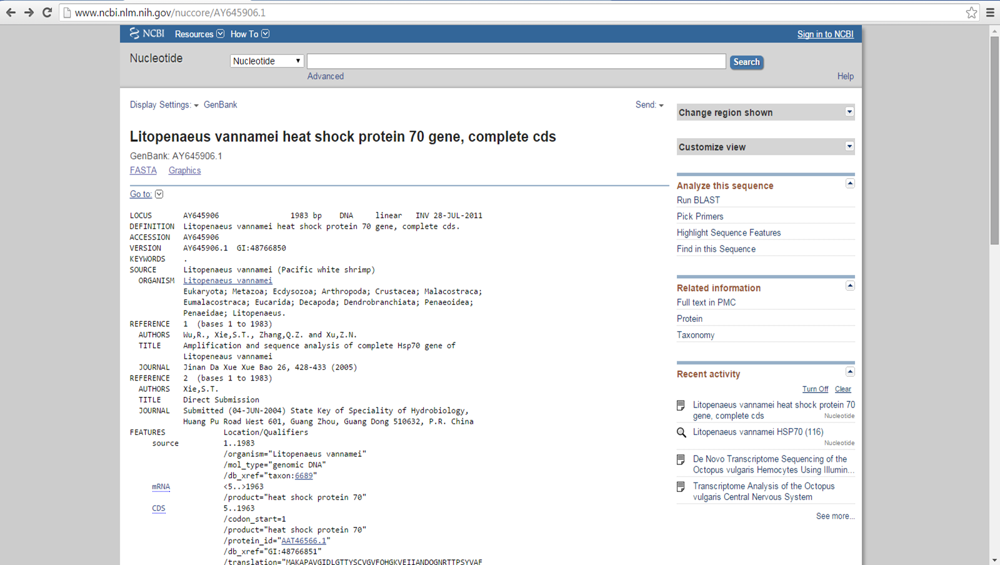

#My favorite gene
---
##Hsp70
This page was created by **Laura L. López**

**Is it this gene present in the White shrimp transcriptome?** 
---

###First step

**-** Primarily, I get a sequence from Genbank.

**-** I obtain this screenshot of the NCBI page:

**-** Then I downloaded the sequence in **fasta** format. The screenshot is below.

###Second step

**-** I opened the jupyter page to make the blast of this sequence.

**-** I checked that my fasta file was in the correct folder.

	`ls query`

**-** I checked the number of sequences in the fasta file of the database of uniprot_sprot.
	
	`ls -s db\`

**-** I head the fasta sequence of Hsp70 gene.

	`head query/L-vannamei-Hsp70.fasta`

**-** I make a blast of my uniprot_sprot database.

`makeblastdb \`

`-dbtype prot \`

`-in db/uniprot_sprot.fasta \`

`-out db/uniprot_sprot` 

**-** Then I blasted my Hsp70 sequence with the database that I chose.

`blastx \`

`-query query\L-vannamei-Hsp70.fasta \`

`-db db\uniprot_sprot \`

`-out out\Lvannamei_Hsp70_blastx_uniprot.out`

**-** I observed the blast results and I obtain a lof of matches.

`cat out\Lvannamei_Hsp70_blastx_uniprot.out`

 

